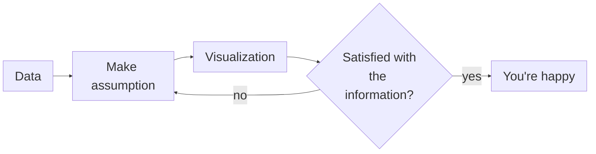

Withee Poositasai (Lookkid)

---
kicker: Nice to meet you :)
title: Withee Poositasai (Lookkid)
---

<LogoRow logo="/logos/kmutt.svg" alt="King Mongkut's University of Technology Thonburi">
  <strong>Bachelor</strong> — Computer Engineering, KMUTT
</LogoRow>
<LogoRow logo="/logos/tallinn.svg" alt="Tallinn University">
  <strong>Master</strong> — Open Society Technologies, TLU
</LogoRow>
<LogoRow logo="/logos/wevis.svg" alt="WeVis" height="2.25rem">
  <strong>Now</strong> — Software Engineer &amp; Co-founder, WeVis
</LogoRow>

---
layout: bigtype
kicker: But first,
title: What is <em>data?</em>
---

Throw me some words

---
layout: define
term: Data (n.)
definition: a collection of values that conveys information
---

---
layout: stats
columns: 4
stats:
  - { value: 80 }
  - { value: 86 }
  - { value: 112 }
  - { value: 169 }
  - { value: 66 }
  - { value: 53 }
  - { value: 63 }
  - { value: 59 }
---

---
src: ./pages/chiangmai-aqi.md
---

---
layout: bigtype
kicker: Let's get closer
title: Do you have any <em>data about you?</em>
---

Think about what you track, record, or post. Data doesn't have to be about numbers!

---
layout: showcase
side: right
image: /parliament-watch.png
kicker: BKK-based civic tech
title: WeVis
subtitle: We use technology to help create a healthy democratic society through transparency and civic participation with open data.
foot: parliamentwatch.wevis.info
---

---
title: Open data on our radar
---

- **Election** — [election69.wevis.info](https://election69.wevis.info)
- **National Budget** — [openbudget.wevis.info](https://openbudget.wevis.info)
- **Parliament Activities** — [parliamentwatch.wevis.info](https://parliamentwatch.wevis.info)

<Callout icon="lucide:table">
  Let's see —
  <a href="https://docs.google.com/spreadsheets/d/1HxHsCAc_2j-nHvmLx_XF5Je49gidRRoRtJ7NwCNURpA/edit?gid=706401250" target="_blank">example data</a>
</Callout>

---
foot: wevis.info/partyunityvisual
---

<Figure src="/wevis-vote-absence.png" alt="WeVis chart comparing the average share of Thai MPs who were absent from or skipped votes, per party, across government and opposition periods" />

---
layout: define
term: Data Visualization (n.)
definition: Using visuals to represent data, which helps convey specific information
---

---
src: ./pages/chiangmai-aqi.md
---

---
foot: "Charles Joseph Minard, 1869 — Carte figurative des pertes successives en hommes de l'Armée française"
---

<Figure src="/minard-napoleon-1869.png" alt="Minard's 1869 flow map of Napoleon's 1812 Russian campaign: a tan band thinning from the Niemen to Moscow, a black band for the retreat, with a temperature chart beneath" />

<!--
Minard, 1869 — the Grande Armée's march on Russia, 1812-13.

Six variables in one image: troop count (band width), longitude, latitude,
direction of travel (tan = advance, black = retreat), date, and temperature
on the axis below the return path.

The number to say out loud: 422,000 men crossed the Niemen. 10,000 came back.
You don't read that figure here — you see the band starve down to a thread.

Tufte called it possibly the best statistical graphic ever drawn. Note it is
not a chart *about* a map; the geography IS the x-axis.
-->

---
foot: "John Snow, 1854 — cholera deaths around the Broad Street pump, Soho, London"
---

<Figure src="/snow-cholera-1854.jpg" alt="Snow's 1854 dot map of Soho: black bars stacked along the streets mark cholera deaths, clustering densely around the Broad Street water pump" />

<!--
John Snow, 1854 — the Broad Street outbreak in Soho. ~600 dead in weeks.

CHOLERA, not plague. And a public street pump, not tap water: the well was
contaminated by a leaking cesspit. Every black bar is a death, stacked at the
address where it happened. The cluster centres on the Broad Street pump.

The argument was against miasma theory — bad air would not respect a pump's
catchment. The map made a waterborne cause visible.

Two honest caveats worth saying, because the story is usually mythologised:
the pump handle came off BEFORE the map was drawn, and the outbreak was
already declining. The map documented and argued the case; it did not trigger
the intervention. Its power was rhetorical.

(If asked about piped water: that is Snow's OTHER study — the Southwark &
Vauxhall vs Lambeth water-company comparison. A table, not this map.)
-->

---
kicker: Humans just try to make sense of this world
title: Data visualization as a way we <em>perceive</em>
---

---
src: ./pages/vis-questions.md
---

---

<Figure src="/eda-ggplot.png" alt="RStudio: a ggplot call colouring words-per-minute by director, and the resulting horizontal bar chart of every movie ranked by dialogue speed" />

---
kicker: Don't give up
title: Assumption loop
---

---

<Figure src="/eda-meme.png" alt="Tuxedo Winnie the Pooh meme: plain Pooh captioned 'Try to vis until it looks nice', tuxedo Pooh captioned 'Exploratory Data Analysis (EDA)'" />

---
kicker: And humans always want to make a point
title: Data visualization as a way we <em>communicate</em>
---

---
layout: showcase
side: right
image: /directors-dialogue.png
title: Final Result
subtitle: Directors' Dialogue
foot: https://visplayground.punchup.world/2024/directors-dialogue/
---

[View project](https://visplayground.punchup.world/2024/directors-dialogue/)

---
layout: showcase
side: right
image: /ordinary-unfold.png
title: More Examples
subtitle: OrdinaryUnfold — bite-size visualization and storytelling experiments
foot: ordinaryunfold.com
---

[View projects](https://ordinaryunfold.com)

---
layout: bigtype
title: Let's take a <em>breath</em>
---

---
layout: agenda
kicker: Your turn
title: Visualizing <em>data about you</em>, together
items:
  - topic: Get into a pair
  - topic: Think about data you have about both of you
  - topic: Go through the 3 questions and make a data visualization
  - topic: Iterate, if you want (and if you have time)
  - topic: Present it by going through the 3 questions
---

---
kicker: Data is digital, but your vis is not
title: We will make a <em>physical</em> visualization
foot: "Source: nightingaledvs.com"
---

<FigureRow>
  <Figure src="/physical-jakarta.jpg" alt="Middle school students sitting on a floor, drawing charts by hand on large sheets of paper" caption="<a href='https://nightingaledvs.com/teaching-data-visualisation-to-middle-schoolers-in-jakarta/' target='_blank'>Middle schoolers in Jakarta</a> — pens, paper, no software" />
  <Figure src="/physical-cable-ties.jpg" alt="A board covered in coloured cable ties clustered into a network, each cluster labelled with a name" caption="<a href='https://nightingaledvs.com/plastic-portrait-cable-ties/' target='_blank'>Plastic Portrait</a> — technical skills, one cable tie at a time" />
  <Figure src="/physical-puppy-olympics.jpg" alt="A hand-drawn poster titled Ellis Puppy Olympics with orange bars scoring two dogs across skills like sit, stay and fetch" caption="<a href='https://nightingaledvs.com/the-ellis-puppy-olympics-a-kids-data-visualization-challenge/' target='_blank'>The Ellis Puppy Olympics</a> — a kid ranking two dogs" />
</FigureRow>

---
src: ./pages/vis-questions.md
---

---
layout: bigtype
kicker: Beyond the visualization
title: What should we <em>keep in mind</em>
---

---
layout: showcase
side: right
image: /woke-game.png
title: We can never be <em>neutral</em>
subtitle: Personal agenda, bias, and worldview are always a reason we communicate
---

[Woke Game is Bad Game?](https://ordinaryunfold.com/woke-game-is-bad-game)

---
title: Correlation is not (always) causation
---

_Visualizations need a supporting explanation_

<FigureRow>
  <Figure src="/spurious-correlations.png" alt="Tyler Vigen's Spurious Correlations: a line chart showing the popularity of the 'not sure if' meme tracking almost exactly with the number of air traffic controllers in Montana" caption="<a href='https://tylervigen.com/spurious-correlations' target='_blank'>Spurious Correlations</a> — two lines can match beautifully and mean nothing" />
  <Figure src="/pentagon-pizza.png" alt="Pentagon Pizza Index dashboard: a DOUGHCON readiness meter, an OSINT news feed, and live activity cards for pizza shops near the Pentagon" caption="<a href='https://www.pizzint.watch' target='_blank'>Pentagon Pizza Index</a> — late-night pizza orders as a crisis alarm" />
</FigureRow>

---
title: Stereotypes and Inclusiveness
---

Pictograms: a simplification of society

<Figure src="/wc-pictograms.jpg" alt="A set of restroom pictograms: WC lettering, a paired man and woman sign, a man alone, a woman alone, a figure in a skirt changing a baby, and a figure in a wheelchair" />

---
layout: bigtype
kicker: Back to you
title: Anything left to <em>ask</em> or <em>discuss?</em>
---

---
layout: panels
kicker: Grab a pen on your way out
title: Self-reflection
panels:
  - { icon: "lucide:heart", title: What you feel }
  - { icon: "lucide:lightbulb", title: What you learned }
  - { icon: "lucide:message-circle", title: Whatever you want to tell me }
---
